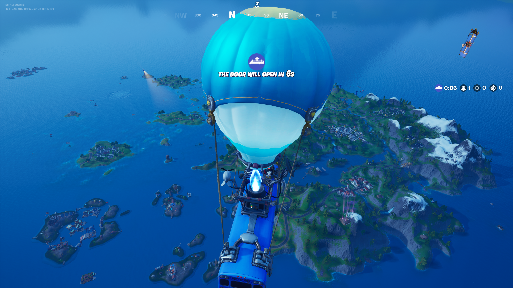

# Fortnite-Offiline — Chapter 2 Season 3

Projeto local de estudo para **Fortnite 13.40 / CL 14113327 / UE 4.25** usando Reboot Launcher, Project Reboot 3.0 e Lawin Embedded.

**Marco atual:** usuário entrou no lobby, conectou ao host Apollo, iniciou o Battle Bus, saltou e andou pelo mapa. O teste definitivo usou **Headless On**, backend e game server locais, **com internet conectada**. Execução completamente offline, bots/bosses e estabilidade prolongada ainda não foram validados.



## Comece aqui

- **[Como preparar e rodar](docs/COMO_RODAR_REBOOT.md)**: pré-requisitos, comandos de compilação/configuração e ordem Host → Play → partida → Start Bus.
- **[Validação manual e evidências](docs/REBOOT_MANUAL_VALIDATION.md)**: capturas, trechos sanitizados do log, DLLs realmente carregadas, Headless e limites do teste.
- **[Histórico de tudo que fizemos](docs/PROJECT_HISTORY.md)**: fases iniciais, auditorias, runtime próprio congelado, preparação Reboot e próximas etapas.
- [Arquitetura Reboot](docs/REBOOT_COMPONENT_MAP.md), [auditoria Launch/auth/EAC/TLS](docs/REBOOT_LAUNCH_AUDIT.md), [fluxo de bots ainda não validado](docs/REBOOT_BOT_FLOW.md).

## Reproduzir a preparação

Windows x64, PowerShell 7, Git, VS 2022 Desktop C++, MSVC v143 **14.44.35207**, Windows SDK **10.0.26100.0**. O SDK Flutter oficial **3.29.3 / Dart 3.7.2** fica portátil no projeto.

```powershell
git clone https://github.com/BernardoHille/Fortnite-Offiline.git
Set-Location Fortnite-Offiline
./scripts/restore-reboot-stack.ps1 -IncludeFlutterSdk
./scripts/build-reboot3.ps1 -Configuration Both
./scripts/build-reboot-launcher.ps1
./scripts/configure-reboot-launcher.ps1 -BuildPath 'D:\Games\FortniteLocal\13.40-CL-14113327\13.40'
```

Esses comandos não iniciam GUI, Fortnite ou backend e não baixam outra build do jogo. A instalação existente precisa ficar fora do Git. O configurador deixa contas/senhas vazias e preserva settings já existentes. Veja o guia antes da execução manual: o fluxo upstream usa auth DLL, suspensão de auxiliares e hooks, já documentados.

Saídas locais: `reboot/artifacts/reboot3/{Debug,Release}/Project Reboot 3.0.dll` e bundle `reboot/artifacts/launcher/Release/`. Execute a GUI a partir do bundle completo, mantendo DLLs/plugins/data junto ao EXE. Na máquina original os artefatos já estão preparados; não precisa recompilar/importar o jogo novamente.

## O que este Git preserva

```text
reboot/stack.lock.json        repositórios, commits, SDK/toolchain e hashes
reboot/patches/               correções mínimas de compilação upstream
reboot/locks/                 pubspec.lock completo da GUI
reboot/config/                perfil reproduzível sem dados pessoais
scripts/*reboot*.ps1          restauração, compilação, configuração e verificação
docs/                        auditorias, histórico, guia e evidências selecionadas
runtime-mod/                 controller/Season13Runtime próprios, congelados
backend/, gameserver/        patches/referências históricas; não integrados ao Reboot
```

Checkouts/SDKs podem ser reconstruídos dos locks; não são vendorizados. Jogo/PAKs/chaves, executáveis/DLLs/PDBs, saves, logs brutos e settings com contas/senhas **não são publicados**. As DLLs auxiliares baixadas pelo launcher foram identificadas por hashes e correspondem ao commit oficial fixado; seu download não comprova que todas foram injetadas.

No Git ficam todos os scripts e patches necessários para reconstruir nossa preparação. Credenciais/perfis pessoais devem ser configurados localmente. O nome "Offiline" é o nome escolhido para o repositório, não uma afirmação de que o teste já ocorreu sem internet.

## Próximas etapas

Repetir host/cliente/ônibus/mapa e validar encerramento; investigar falha inicial de host/Log Out; testar operação totalmente desconectada; depois planejar Bot Lobby/Phoebe/bosses. Season13Runtime ainda não foi integrado. Os relatórios READY B anteriores são históricos da preparação, antes do teste manual bem-sucedido.

[Licenças e componentes terceiros](THIRD_PARTY_NOTICES.md) · [Setup histórico do backend anterior](docs/SETUP.md) · [Preparação Reboot e hashes dos builds](docs/REBOOT_INSTALL_REPORT.md)
