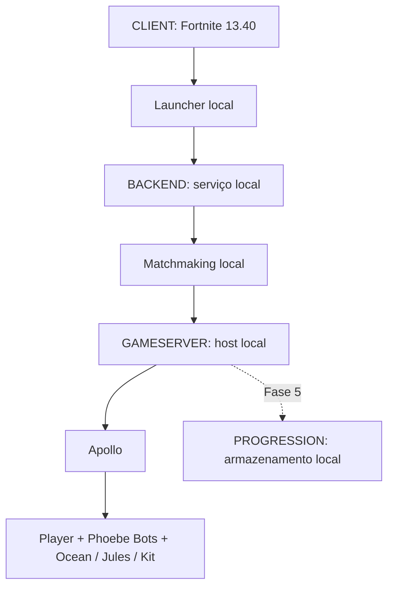

# Arquitetura — Fase 2 em preparação

Documento histórico da infraestrutura existente. A proposta arquitetural atual, aguardando aprovação, está em [ARCHITECTURE_V2](ARCHITECTURE_V2.md) e [COMMUNITY_STACK_DECISION](COMMUNITY_STACK_DECISION.md): STACK B, reutilização parcial e boot ainda bloqueado. As evidências e limites abaixo são preservados; nenhum runtime comunitário foi integrado.

Fase 1 concluída; Fase 2 autorizada. O fluxo testado atual é coordenador/smoke -> HTTP loopback -> sessão fictícia própria -> snapshots de perfil -> timeline/config -> bootstrap REST simulado. O cliente real não entrou nesse fluxo. A auditoria e allowlist estão em `PHASE2_CLIENT_BOOT.md`; o gate de execução e bloqueios em `PHASE2_PRELAUNCH.md`.

Na auditoria de roteamento, AES foi usada exclusivamente para leitura de PAKs locais. A presença de configurações MCP foi confirmada, mas não um override externo utilizável pelo Shipping: ROUTE C em [PHASE2_ROUTING_REPORT.md](PHASE2_ROUTING_REPORT.md). Nenhuma configuração original, PAK, executável ou segurança foi alterada; não houve experimento de override.

Modo 2 usa `backend/phase2/server.cjs`, um adaptador seletivo de schemas LawinServer com Express do checkout fixado. Não importa routers genéricos, loja, compras ou MCP mutável. Sessões são opacas, transitórias e próprias; persistência se limita a runtime ignorado. O modo 1 abaixo descreve a infraestrutura histórica e seus guards permanecem no entrypoint original.

O isolamento futuro do CLIENT é independente da proteção BACKEND: o guard Node não cobre o PE Fortnite. Avaliou-se um guest Sandbox sem rede, backend no loopback do guest e build somente leitura, sem hosts/certificados/patches. O teste sem cliente não respondeu dentro do prazo; portanto runtime, GPU e isolamento do guest não estão comprovados. Um mecanismo nativo de endpoints locais do cliente também permanece desconhecido. Não há execução no host como fallback.

O projeto estuda uma instalação fornecida pelo usuário, Fortnite 13.40 / CL 14113327. A build permanece fora do Git. Nenhum componente deve acessar a conta Epic ou os serviços live da Epic. O download inicial de fontes open-source e pacotes npm exige internet; a verificação, compilação após restauração e execução do backend de diagnóstico são locais.

## Fluxo pretendido, ainda não implementado

Esse desenho expressa responsabilidades e o fluxo de coordenação desejado. O backend não transporta pacotes de gameplay: em uma integração futura autorizada, o cliente precisaria comunicar-se diretamente com o host da partida. Não há integração cliente/backend/gameserver executada nesta fase.

| Camada | Responsabilidade | Estado atual |
| --- | --- | --- |
| CLIENT | Binários e assets legítimos fornecidos pelo usuário | ZIP lido; cópia externa extraída mediante autorização; nenhum binário executado |
| Launcher | Selecionar uma instalação e coordenar processos | Coordenador prepara/encerra backend; execução do cliente permanece bloqueada |
| BACKEND | Serviços locais de perfil e encaminhamento em fases futuras | Modo 2: adaptador mínimo de identidade/profile/timeline e diagnósticos, sem proxy ou matchmaking |
| GAMESERVER | Host da partida, mundo e IA | FortExternalServer season-13 compilado; não executado |
| PROGRESSION | Saves locais, quests, recompensas e Battle Pass | Diretório reservado; implementação somente na Fase 5 |

## Isolamento da Fase 1 e guard compartilhado

O script de backend exige `environment=local`, `phase=1` e ambos os hosts `127.0.0.1`. O patch obriga a escuta HTTP em loopback, desativa o parser de query strings, deixa XMPP desativado e bloqueia as rotas de integração com resposta 503. `/health` informa o estado e `POST /__phase1/shutdown` fecha o servidor normalmente. A última rota serve apenas ao teste local, sem autenticação ou conta real. Dados de runtime ficam em pasta ignorada pelo Git.

`backend/offline-guard.cjs` bloqueia conexões TCP externas, consultas DNS externas nas APIs auditadas, sockets UDP, fetch e processos filhos no processo Node. É uma proteção do processo auditado, não uma sandbox completa do sistema operacional. As fontes auditadas não mostraram requisições externas de inicialização. URLs Epic/CDN presentes nos payloads upstream são um problema real para futura integração; suas rotas não estão acessíveis na Fase 1. Não foram alterados hosts, certificados, firewall, anti-cheat nem arquivos da build.

## Limites do gameserver escolhido

FortExternalServer é um controlador externo de um processo Fortnite, não um servidor dedicado independente dos assets. O upstream inicia o jogo e usa alocação/escrita de memória e stubs de máquina. Ser um EXE não elimina injeção/patches de memória. Foi escolhido para estudo e compilação da branch exata, não aprovado para execução. Nenhum script deste projeto o inicia, injeta código ou desativa segurança.

O perfil Season13 contém CL 14113327, Apollo e classes Phoebe. Entretanto, `Configuration.h` define `MapToLoad=Athena_Terrain`; `ServerSettings.cpp` efetivamente usa esse valor em vez de `Profile.AssetPaths.MapName= Apollo_Terrain`. Bots e bosses estão desligados; mínimo de jogadores é 2; as coordenadas dos bosses são provisórias. As definições usam o pawn Phoebe genérico e não demonstram visuais, comportamentos, navmesh ou loot fiel dos três bosses. Essas questões devem ser resolvidas nas fases próprias, após autorização, sem violar os limites do projeto.

O fluxo de conexão do cliente ainda é uma questão técnica aberta: as instruções upstream de proxy/SSL ou execução não foram adotadas. Antes da primeira execução será necessário verificar uma conexão que preserve a restrição de não implementar bypass de autenticação oficial, anti-cheat ou segurança dos serviços atuais. Autorizar uma fase não altera essas restrições.
