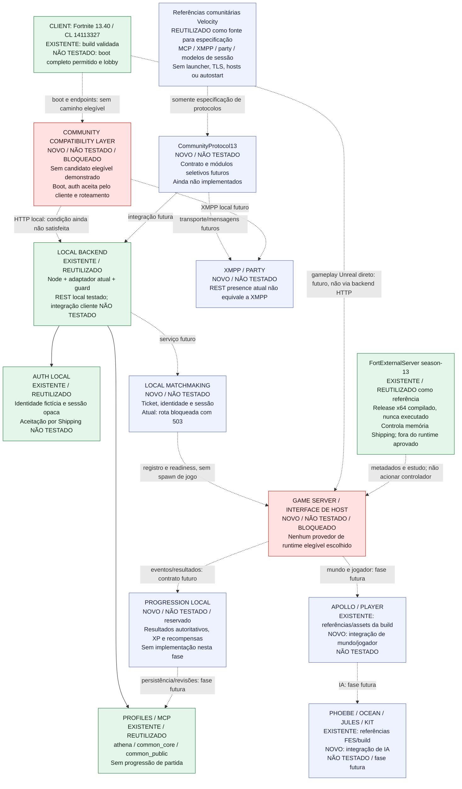

# Arquitetura V2 — backend modular local, cliente bloqueado

Proposta de 2026-10-07, **STACK B**, aguardando aprovação. Substitui as premissas de arquitetura da Fase 2; documentos anteriores conservam as evidências históricas. [Decisão](COMMUNITY_STACK_DECISION.md), [comparação](COMMUNITY_STACK_COMPARISON.md) e [migração](COMMUNITY_STACK_MIGRATION.md).

**Não existe camada comunitária selecionada que tenha demonstrado boot/roteamento permitido para nosso Shipping 13.40.** A arquitetura abaixo identifica o espaço dessa camada, mas não o preenche com um launcher incompatível. Nenhuma nova integração, servidor, modificação do jogo ou rede foi executada.

## Estados

| Estado | Significado |
| --- | --- |
| EXISTENTE | Arquivo, build ou artefato já presente; não significa que sua função runtime passou |
| REUTILIZADO | Base existente conservada pela proposta ou referência selecionada para especificação futura |
| NOVO | Componente/contrato planejado, ainda sem implementação |
| NÃO TESTADO | Integração cliente/runtime ausente; não promover a funcionalidade comprovada |

No diagrama, linhas tracejadas são **contratos futuros ou referências**, sem conexão operacional implementada. As linhas sólidas do backend representam sua composição existente, testada anteriormente por REST sem cliente. A memória/controlador FES permanece fora do caminho executável proposto.

## Diagrama de camadas e bloqueios

## Responsabilidades e fronteiras

**Cliente e compatibilidade.** A build permanece intacta. O espaço da camada comunitária abrange boot e seleção de serviços locais. Nenhum launcher auditado atende integralmente às restrições. Não preencher esse espaço com CA/hosts/TLS bypass/injeção de auth, valores de credenciais ou patch de Shipping. A seleção de módulos do backend não soluciona essa fronteira.

**Backend e auth.** Conservar `backend/phase2/server.cjs`, guard e coordenador. A identidade local e sessões fictícias não representam conta Epic. Permanecer em loopback com as proteções existentes. O guard protege APIs Node auditadas, não o processo do jogo. Não importar inicializadores comunitários com escuta ampla, rede remota ou processos filhos.

**Profiles e protocolo.** Conservar `backend/phase2/profiles.cjs` e snapshots existentes. `CommunityProtocol13` é apenas o nome do contrato futuro proposto. Velocity é referência de JSON/MCP, mensagens XMPP/party e DTOs; código será considerado por arquivo e fechamento de dependências, com licença/proveniência. Anora é referência comparativa, não backend instalado. Auth própria de terceiros não deve substituir automaticamente nossa sessão mínima.

**XMPP/party.** A presença REST atual não fornece transporte XMPP, binding, presença/MUC ou gerenciamento completo de party. São camadas futuras distintas. Código de mensagens não comprova compatibilidade dos endpoints ou transportes esperados pelo cliente 13.40.

**Matchmaking.** Serviço futuro recebe identidade/ticket, seleciona uma sessão elegível e descreve host/porta/versão/playlist. Não inicia Shipping, não injeta DLL e não considera temporizador ou conexão TCP como prova de readiness de uma partida Unreal. O backend atual continua respondendo 503 nessa fronteira. O autostart Velocity não integra a proposta.

**Host e gameplay.** Cliente se comunica diretamente com o host para o protocolo de jogo; backend HTTP não é um túnel entre ambos. Não há provedor de host autorizado selecionado. FES compilado é referência preservada: seu controle de processo/memória, bridge/stubs/hooks e espera de menu não se tornam uma interface independente por trocar o launcher. Separabilidade de dados declarativos é **INFERIDO**, não módulo extraído. Gameplay dependente de objetos Unreal não foi implementado fora desse runtime.

**Apollo, IA e bosses.** Os paths/classes/nomes estão **CONFIRMADO POR CÓDIGO** no perfil FES, sem execução. Default de mapa divergente, IA desligada e posições provisórias permanecem documentados. Não há prova de navegação, visuais, loot ou lógica fiel; não avançar para essas fases agora.

**Progressão.** Campo `xp`, setter de tier e persistência de profile não equivalem a progressão autoritativa. A fase futura precisará de origem validada dos resultados e atualização de revisões sem concessões arbitrárias. Não se criou serviço de XP, quest, Battle Pass ou grants.

## Condições de avanço

O primeiro passo após eventual aprovação é especificação estática dos módulos de protocolo, sem execução de componentes. Implementação depende de autorização posterior de escopo; experimento com cliente depende também de evidência de boot/roteamento permitidos. Se essa evidência continuar ausente, a arquitetura permanece parcial e bloqueada.

Neste ponto o trabalho para. A escolha **STACK B** preserva módulos úteis e não altera a decisão C de boot da [auditoria de lançamento](PHASE2_LAUNCH_CHAIN.md).
