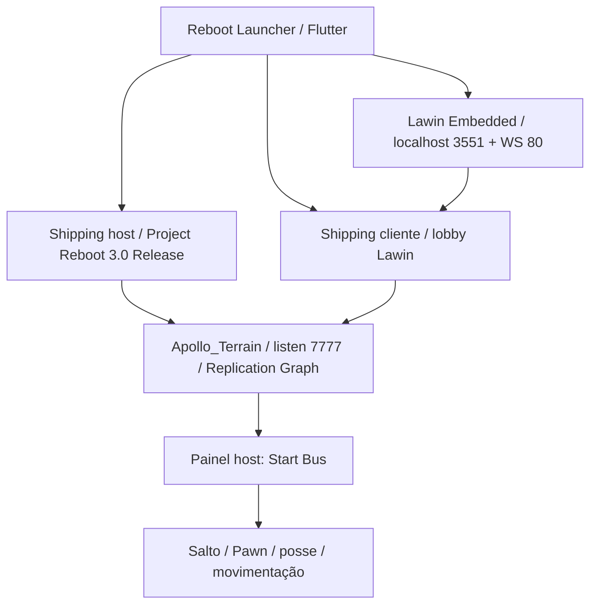

# Histórico do projeto e próximos marcos

Este documento distingue preparação por código, execução manual e objetivos futuros. Estado atual: **runtime Reboot validado manualmente em localhost com internet conectada**, sem bots e sem integrar Season13Runtime próprio.

| Etapa | O que fizemos | Resultado / documentação |
| --- | --- | --- |
| Fase 1 | Conferência de ferramentas/build, extração autorizada fora do repositório, fontes Lawin/FortExternalServer fixadas, patches de isolamento e dependências | [PHASE1_REPORT](PHASE1_REPORT.md), [STACK_AUDIT](STACK_AUDIT.md), [BUILD_VALIDATION](BUILD_VALIDATION.md) |
| Fase 2 inicial | Backend local simulado/profiles, scripts de preparo/stop e testes de isolamento; revisão de entrada do cliente | [PHASE2](PHASE2.md), [PHASE2_PRELAUNCH](PHASE2_PRELAUNCH.md). Lobby ainda não demonstrado naquela arquitetura |
| Auditoria estática | PAKs/INIs, routing, cadeia Epic/wrappers/Shipping, argumentos e limites de boot independente | [ROUTING_REPORT](PHASE2_ROUTING_REPORT.md), [LAUNCH_CHAIN](PHASE2_LAUNCH_CHAIN.md). Conteúdo do jogo/chaves extraídas ficaram locais |
| Observação manual inicial | Procmon, preparação/correção do BAT, várias aberturas misturadas; FortniteLauncher abriu Epic | [RUNTIME_OBSERVATION](PHASE2_RUNTIME_OBSERVATION.md). Evidência inconclusiva daquela sessão, sem repetir essa entrada |
| Revisão comunitária | Comparação FES/Reboot/Lawin/Velocity e separação de camadas reutilizáveis | [COMPARISON](COMMUNITY_STACK_COMPARISON.md), [DECISION](COMMUNITY_STACK_DECISION.md), [ARCHITECTURE_V2](ARCHITECTURE_V2.md) |
| Runtime próprio ARCH C | Controller + Season13Runtime R0/R1, PE/build guard, scanner e fixtures offline; três configurações compiladas | [IMPLEMENTATION](RUNTIME_BOOTSTRAP_IMPLEMENTATION.md), [ADDRESS_MAP](SEASON13_ADDRESS_MAP.md). Sem resolução real GWorld/attach no jogo; componente congelado |
| Preparação Reboot | Checkouts oficiais fixados, dependências/Flutter, Debug/Release x64 DLL e GUI Release, correções mínimas de build, settings locais, auditoria completa Launch/auth/EAC/TLS | [INSTALL_REPORT](REBOOT_INSTALL_REPORT.md) registrou **READY B antes do teste manual**, não falha de compilação |
| Execução pelo usuário | Lawin Embedded, host local Apollo, DLL Reboot custom, cliente lobby, partida, Start Bus, salto/Pawn e movimentação | [MANUAL_VALIDATION](REBOOT_MANUAL_VALIDATION.md). Capturas/log confirmam marco; rede conectada; houve falha anterior de host e erro relatado no logout |
| Publicação | Fontes próprias/scripts históricos, patches Reboot, lock Pub, fontes/toolchains fixados, perfil sem credenciais, scripts de reprodução, hashes e evidências selecionadas | [COMO_RODAR](COMO_RODAR_REBOOT.md), [stack lock](../reboot/stack.lock.json). Jogo, SDKs, DLLs, logs brutos e settings pessoais excluídos |

## Arquitetura que chegou ao gameplay

Os loaders auxiliares/auth e seus efeitos estão em [COMPONENT_MAP](REBOOT_COMPONENT_MAP.md); o diagrama é a divisão funcional, não um inventário completo de subprocessos. Backend antigo backend/, FES e runtime-mod/ não foram integrados para alcançar esse marco.

## O que falta

1. Repetir host/cliente/ônibus/mapa e registrar critérios de sucesso e encerramento, incluindo a divergência Headless e o erro de Log Out.
2. Validar **operação totalmente offline** com dependências já presentes. O nome do repositório não é evidência de ausência de rede.
3. Investigar falhas de host/logout e warnings C++ relevantes antes de prometer estabilidade.
4. Só depois planejar Bot Lobby: manager, SpawnBot, controllers/Pawns, Phoebe versus PlayerBot manual, navegação e quantidade. O gate AI retorna false no commit fixado; não foi modificado.
5. Bosses/AI e progressão local continuam objetivos futuros, não recursos demonstrados.
6. Season13Runtime só poderá ser integrado em uma etapa específica, após revisar compatibilidade e propósito. Nenhuma integração implícita nesta publicação.

Os relatórios anteriores conservam suas conclusões como registros históricos. Quando dizem "não executado" ou "READY B", referem-se à etapa de preparo. Use este histórico, o README e a validação manual para o estado atual.
