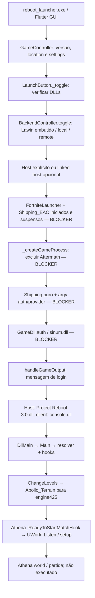

# Reboot — componentes e cadeia de Launch

Fontes no [stack lock](REBOOT_STACK_LOCK.md). **CONFIRMADO POR CÓDIGO; NÃO TESTADO EM RUNTIME.** Launcher e host são componentes diferentes. Launcher GUI Flutter não é o runtime mod do jogo.

## Caminho completo do botão

Paths abaixo relativos a reboot/launcher/ ou reboot/reboot3/Project Reboot 3.0/ quando indicado. Um ramo host pode ocorrer antes do client e repete auxiliares/Shipping/auth para outro processo. Não é sempre um único Shipping.

| Ordem | File / Function (linha aprox.) | Process / argumentos category | Network effect | System effect / classificação |
| --- | --- | --- | --- | --- |
| 0 abrir GUI | gui/lib/main.dart:_startApp ~47; pager._checkUpdates ~104 | reboot_launcher.exe / GUI | Browser ws terceiros; GitHub update/DLL downloads | Settings/assets, registro HKCU protocol; CONFIG/REMOTE_SERVICE |
| 1 Click Launch | gui/lib/src/button/game_start_button.dart:build ~59 → _toggle ~71 | GUI, bool host | Nenhum ainda | Seleciona version; CONFIG |
| 2 valida DLLs | _toggle ~98 → _getDllFileOrStop ~798 → DllController.getInjectableData ~162 | GUI / paths custom ou defaults | Download se ausente; defaults remotos | Arquivos do launcher; CONFIG/RUNTIME_MOD/REMOTE_SERVICE |
| 3 backend | _toggle ~105 → BackendController.toggle ~131 → startAuthBackend | lawinserver.exe no embedded; proxy Dart no remote; local existente | HTTP3551, WS80 no backend fonte | Process start, possível kill de porta ocupada; BACKEND_LOCAL/NETWORK |
| 4 linked host | _startMatchMakingServer ~176 → _askForAutomaticGameServer ~207 | GUI/host Shipping posterior | Escolha host local por config | Prompt/ramo; CONFIG/PROCESS |
| 5 wrappers | _startGameProcesses ~234 → _createPausedProcess ~372 → common/util/os.dart:suspend ~403 | FortniteLauncher.exe, Shipping_EAC.exe, sem args explícitos, env OpenSSL | Efeitos de inicialização dos auxiliares desconhecidos | Process.start seguido de NtSuspendProcess; PROCESS/ANTI_CHEAT/BLOCKER |
| 6 preparar Shipping | _createGameProcess ~264 | GUI, version.location | Nenhum exigido pela exclusão | Exclui GFSDK_Aftermath_Lib.x64.dll; CONFIG/BLOCKER |
| 7 args e criação | game_metadata.dart:createRebootArgs ~199; game_start_button.dart ~304/311; os.dart:startProcess ~354 | Shipping puro, app/environment, UE, auth, anti-cheat/provider | Shipping live effects desconhecidos | Process.start; PROCESS/AUTH/ANTI_CHEAT |
| 8 auth DLL | _startGameProcesses ~259 → _injectOrShowError ~765 → injectDll ~286 | sinum.dll por default | Redirecionamento/auth declarado; TLS internals UNKNOWN | Memory allocation/write/LoadLibrary; AUTH/RUNTIME_MOD/BLOCKER |
| 9 callback login | game_metadata.dart:handleGameOutput ~267 → _onLoggedIn ~440 | Shipping stdout/stderr | Não autentica por si; observa mensagem | Seleciona ramo host/client; CONFIG |
| 10 client/host DLL | _onLoggedIn ~449/456 | client console.dll; host gameServer DLL custom; memory.dll só Chapter1 | Nenhum comprovado por callback | Inject runtime; RUNTIME_MOD. Host ainda chama killProcessByPort |
| 11 host entry | Reboot3 dllmain.cpp:DllMain ~1854 → Main ~906 | DLL dentro de Shipping | Hooks NetDriver/sessão | Runtime init, version scan, MinHook, hooks/dumps; RUNTIME_MOD/NETWORK/AUTH/UNKNOWN |
| 12 travel | Main ~1220 → ChangeLevels ~677 | Shipping / ExecuteConsoleCommand ou outro branch de travel | Netmode/session relacionado | engine425 e não Creative escolhe Apollo_Terrain; GAMEPLAY |
| 13 mundo/partida | Reboot3 FortGameModeAthena.cpp:Athena_ReadyToStartMatchHook ~315 | Shipping | UWorld.Listen ~849; UDP/game beacon | Setup de playlist/teams/AI/match; GAMEPLAY/NETWORK |
| 14 exposição host | GUI _onGameServerInjected ~479 → ping local/public | Launcher | Ipify, UDP UPnP, browser WS | Router port mapping/publicação; NETWORK/REMOTE_SERVICE |

## Backend e portas

Backend **Lawin**, fontes em launcher/auth_backend, EXE já incluído no commit em gui/assets/backend/lawinserver.exe. Bundle Flutter copia assets; BackendController inicia pelo caminho data/flutter_assets/assets/backend/lawinserver.exe. Também oferece backend local existente ou proxy HTTP para remote. Não é o backend/ do nosso projeto, que permanece preservado.

| Serviço | Porta/endereço declarado | Quem inicia / momento |
| --- | --- | --- |
| Lawin REST | 3551 (fonte auth_backend/index.js) | _toggle → startAuthBackend embedded, antes do jogo |
| XMPP/matchmaker Lawin | WS80 (structure/xmpp.js) | Import do backend fonte; comportamento de EXE embutido não executado/confirmado |
| Proxy backend | 127.0.0.1:3551 | _startRemote para local em outra porta ou backend remote |
| Game server | GUI default7777; Reboot World.cpp Port=7777-AmountOfListens+1 | Athena_ReadyToStartMatchHook → UWorld.Listen |
| Beacon em UE425 | Primeira listen usa ListenPort=Port-1 (7776); URL.Port=Port (7777) | UWorld.Listen; distinguir beacon do game net driver, sem bind observado |
| Server browser | ws://192.99.216.42:8080 | Construtor ServerBrowserController, ao abrir GUI |
| Downloader aria2 RPC | localhost6800 | Downloader apenas; não iniciado |
| IP público/UPnP | Ipify HTTP externo / SSDP router; game UDP default7777 | Após host, ramo _checkPublicGameServer; não executado |

## Host/runtime

Project Reboot3 gera **DLL**, não host EXE independente. A GUI injeta gameServer no **host Shipping** após callback de login. DllMain imediatamente cria Main; Main configura runtime/hook e muda mapa, não é inspector passivo. Depois Athena_ReadyToStartMatchHook configura listen/world/gameplay. GUI ImGui interna do host é GuiThread, diferente da GUI Flutter externa.

Guards multiversão Reboot não equivalem ao Season13BuildGuard: há condição 13.40/engine425, mas reconhecimento estrito de SHA/CL14113327 não é implementado nesse runtime. Nosso Season13Runtime não foi integrado.

[Suporte específico](REBOOT_BUILD_SUPPORT.md), [fluxo de bots](REBOOT_BOT_FLOW.md), [operações proibidas nesta etapa](REBOOT_LAUNCH_AUDIT.md). Ausência de execução impede afirmar que callback/login/travel/listen funciona na instalação alvo.
