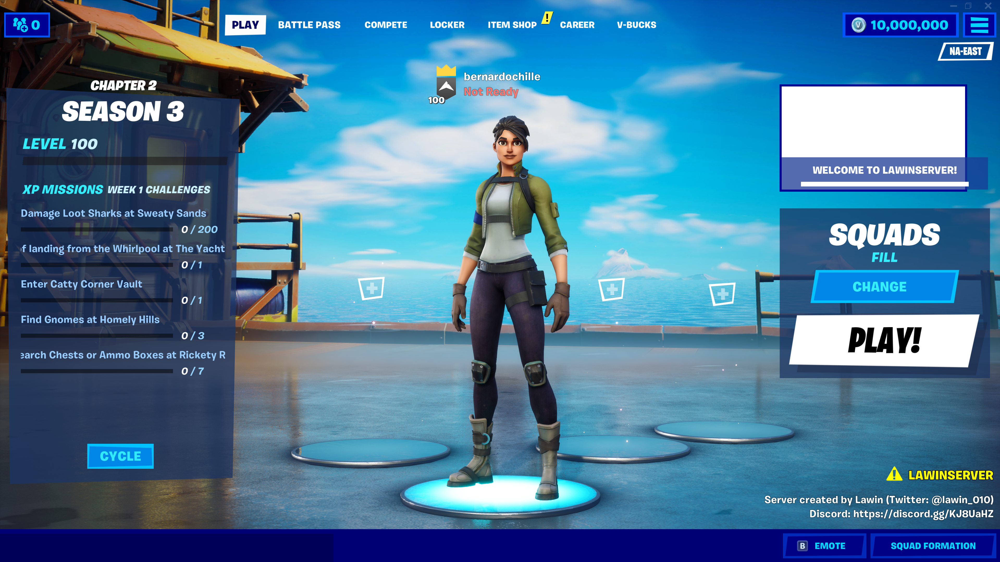

# Validação manual — lobby, Apollo e Battle Bus

**Marco obtido em 2026-10-07 pelo usuário: lobby Lawin, conexão à partida, Battle Bus, salto e movimentação no mapa.** A internet estava conectada. Backend e host usados eram locais; execução com a rede totalmente desconectada ainda não foi validada.

Este relatório atualiza o estado do projeto após a preparação classificada READY B. As auditorias anteriores descrevem o que ainda não havia sido executado naquela ocasião. O teste manual posterior não apaga os efeitos de auth, suspensão de auxiliares, hooks ou downloads que essas auditorias encontraram.

## Fontes de evidência

- Relato detalhado do usuário neste chat, incluindo opções e ordem do teste.
- Capturas fornecidas pelo usuário, 21:11:42 (lobby) e 21:12:49 (Battle Bus).
- `launcher.log` fornecido pelo usuário, 1.903.299 bytes na leitura; SHA-256 **f02d5c092ef125c6619e8ab6413100ec273316d94ab0dfe64cd7585a51d43311**. O log bruto fica local porque contém argumentos e dados pessoais.
- [Trechos selecionados e sem credenciais](evidence/reboot-runtime-excerpts.txt), com os números das linhas do arquivo fornecido. Não é uma cópia integral nem prova de ausência de tráfego externo.

## O que foi demonstrado

| Etapa | Evidência | Resultado |
| --- | --- | --- |
| Backend Lawin | Log 49: listening 3551; 51: XMPP/Matchmaker 80 | INICIADO no teste manual |
| Auth DLL host | Log 92/94 e 8421/8423: sinum.dll / Injected auth | Carregamento reportado pelo launcher; detalhes internos não auditados |
| Reboot custom Release | Log 2625/2629 e 10938/10948: caminho da nossa DLL / Injected gameServer | Seleção e carregamento reportados pelo launcher |
| Apollo | Log 3568 e 11595: open Apollo_Terrain | Travel executado no host |
| Listen | Log 4714 e 12843: Listening on port 7777 | Host iniciou listen; endereço local informado pelo usuário |
| Replication Graph | Log 4718 e 12847: bShouldUseReplicationGraph: true | Ramo ativo no host, não teste de replicação multiplayer completo |
| Cliente | Log 13288/13290: sinum; 15800/15802: console.dll | Auth/console reportados como carregados no cliente |
| Lobby | Captura 21:11:42 | Lobby Lawin/Season 3 visível |
| Ônibus | Captura 21:12:49 e relato Start Bus no painel do host | Battle Bus visível, um jogador |
| Salto/Pawn | Log 18459–18483: ServerAttemptAircraftJumpHook, SpawnDefaultPawnForHook, final de spawn, efeitos e acknowledge possession | Sequência de salto e criação/posse do Pawn registrada |
| Movimentação | Relato do usuário | Confirmada pelo usuário; captura fornecida não é vídeo de movimentação |

Não foi o Codex que executou o jogo. Durante a publicação apenas foram lidos arquivos, compilados artefatos e preparados Git/documentação; nenhum novo Launch/attach foi realizado.

## Configuração utilizada e ressalva de Headless

Backend informado: **Embedded**, game server address **127.0.0.1**, Detached Off, Lawin local na porta **3551**. Host: build **13.40 CL 14113327**, porta **7777**, Automatic restart Off, custom launch arguments vazios. DLL game server: `reboot/artifacts/reboot3/Release/Project Reboot 3.0.dll`.

Painel do host segundo o usuário: Players required to start **1**, Private IPs are operator marcado, No MCP marcado. São opções do runtime upstream, não mudanças feitas em nosso source. Não foram reproduzidas automaticamente por scripts de configuração.

O relato inicial dizia **Headless Off**. Após conferir a divergência, o usuário confirmou: **o teste definitivo foi Headless**; considera possível funcionar nos dois modos, mas ambos não foram validados de forma isolada. O log mostra **duas tentativas**:

1. Linha 55: headless(false), listen às 21:00:31; linha 8291 registra Fatal error no host.
2. Linha 8386: headless(true), listen às 21:09:02; depois aparecem o cliente, as capturas e o salto às 21:12:57. O storage atual também tem headless=true.

Assim, o perfil versionado adota **Headless On como referência da sessão bem-sucedida registrada no log e confirmada pelo usuário**, em vez de declarar Off igualmente comprovado. No código, headless adiciona nullrhi apenas ao host; o cliente continua com renderização. A causa da falha da primeira tentativa não foi investigada nesta publicação e não foi atribuída automaticamente ao modo Headless Off.

## DLLs baixadas versus carregadas

O log registra downloads de GameDll.console (linhas 5/7), GameDll.auth (10/12) e GameDll.memoryLeak (15/17). Os arquivos são console.dll, sinum.dll e memory.dll. Os hashes Git blob locais correspondem aos arquivos do **commit fixado c6f82298b167ef2076bb59dc621f13dc5bd8d390** no upstream oficial, apesar do downloader usar URL mutável master.

| Arquivo | SHA-256 no teste | Uso observado |
| --- | --- | --- |
| console.dll | a4873bd206a1bbf05eea868d28f4850942fed8eb55a465ecc05604c5bc9c43c7 | Download e carregamento no cliente |
| sinum.dll | fb69e9ee715f5cbbdadd0e8e3cb07ee37b9dc1ac41f8ea04ebee66e4f7026f72 | Download e carregamento host/cliente |
| memory.dll | 09678b68e73eeb4463e3b442e0982eba7ff08b07df0614b12a02ed4c9f17fb7a | Download; **não há confirmação de carregamento** no log fornecido. Source aplica memoryLeak a Chapter 1, não à 13.40 |

Reboot DLL foi compilada localmente e escolhida via custom game server, não baixada de nightly. Nenhuma DLL binária é redistribuída por este repositório; fontes/commits e hashes permitem identificar a origem. Correspondência de hash não audita comportamento interno de autenticação/TLS.

## Integridade e limites

Após o teste, SHA-256 dos quatro EXEs originais Shipping/BE/EAC/FortniteLauncher continuavam iguais ao baseline anterior. Os 429 arquivos já inventariados mantiveram tamanho/timestamp na conferência; isso não afirma ausência de novos saves/logs gerados pelo jogo. Nenhuma atualização/download de outra build foi necessário.

Bots, bosses, população Phoebe, progressão persistente, partidas completas repetidas, clientes remotos e estabilidade prolongada **não foram validados**. Season13Runtime próprio continua separado e não entrou no processo.

O usuário relatou erro após **Log Out**: registrar como incidente de encerramento fora do objetivo dessa sessão, ainda sem diagnóstico. Há também o Fatal error explícito da primeira tentativa. O marco de gameplay obtido não significa ausência de crashes ou logout correto.

Próximo roteiro: [COMO_RODAR_REBOOT](COMO_RODAR_REBOOT.md). Histórico completo: [PROJECT_HISTORY](PROJECT_HISTORY.md). Próxima validação recomendada: repetir a sessão local de forma controlada e testar a dependência de internet separadamente, sem afirmar antecipadamente que o stack é totalmente offline.
