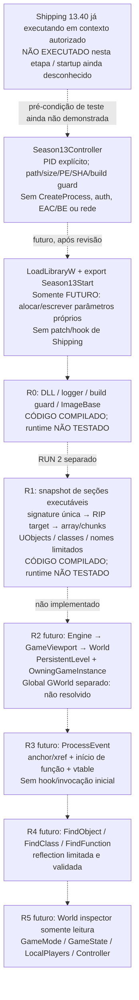

# Shipping → runtime Unreal — ARCH C

Etapa de 2026-10-07. **MILESTONE 0 READY** significa código preparado/compilado para revisão e primeiro teste futuro R0. Não significa DLL carregada no Fortnite, R0 executado ou GObjects/GWorld comprovados. Nenhum Fortnite foi iniciado, nenhum controlador anexou e nenhuma DLL foi carregada no jogo nesta etapa.

O pedido atual autoriza controle/instrumentação de processo para mod local; a finalidade determina a classificação. A decisão STACK B anterior permanece como histórico do plano de backend, que está pausado. Bootstrap/runtime para diagnóstico são o novo escopo. Auth Epic, anti-cheat, TLS/interceptação e gameplay continuam excluídos.

## Arquitetura escolhida

**ARCH C: controlador mínimo + DLL interna Season13Runtime.** O controlador não inicia Shipping: seleciona exclusivamente PID explicitamente informado em teste futuro, verifica identidade e carrega somente a DLL adjacente à sua própria compilação. A DLL entra por export explícito, valida novamente a build e executa no máximo R0 ou R1. DllMain não cria thread, não faz scan, não instala hook nem chama Unreal.

O desenho reaproveita signatures/layouts auditados do FES e a abordagem interna/array em chunks do Reboot, sem importar seus entrypoints ou inicializadores de servidor. [FES trace](FES_RUNTIME_TRACE.md), [Reboot trace](REBOOT_RUNTIME_TRACE.md) e [address map](SEASON13_ADDRESS_MAP.md) detalham a proveniência. Nosso código está em [runtime-mod](../runtime-mod/CMakeLists.txt).

## O que está implementado

| Etapa | Implementação / prova disponível |
| --- | --- |
| Identidade | Season13BuildGuard recusa caminho/arquivo diferentes, tamanho distinto, PE não AMD64, SHA integral diferente ou falta de strings build/CL. Headers carregados devem concordar com disco. Sem fallback de versão. |
| R0 | Export explícito + logger fora da build, base do EXE por GetModuleHandleW, validação duplicada e parada. Compilação comprovada; execução real NÃO TESTADA. |
| R1 | Scanner PE-aware, zero/ambíguo falham, fallback de signature só dentro da mesma build; RIP signed; array chunked, capacidade/count, objeto/class/vtable/internalIndex e amostra de até 8 objetos nos primeiros 256 índices. |
| FName | ABI de NameToString/Realloc derivada do FES, SEH local para diagnóstico, buffers e tamanho limitados; nenhuma chamada ProcessEvent. Uso em thread de diagnóstico e assinatura efetiva ainda NÃO TESTADOS. |
| R2–R5 | Estratégia e critérios documentados; não implementados ou declarados prontos. Não imprimir valores fictícios de World/GameMode/GameState. |

R1 realiza leitura de estruturas e pode chamar conversão de nome/alocador do jogo para produzir texto; isso pode alocar/liberar um FString, embora não altere gameplay. Portanto não descrever R1 como ausência absoluta de efeitos na memória. A afinidade de thread/init dessas duas funções precisa ser revisada antes de RUN 2. Se não for possível validá-las sem mecanismos proibidos, documentar bloqueio, não importar o pump de rede ou hooks de sessão do FES automaticamente.

## Resultado estático do Shipping

Inspeção pelo nosso `Season13Controller --inspect`, sem abrir um processo alvo: build/CL/strings/hash corretos; `SizeOfImage=0x0AA81E00`, timestamp `0x5F36A4A1`. As quatro signatures GObjects principal/alternativa, NameToString e Realloc produziram **0 matches no arquivo em disco**. Isso não prova ausência dessas funções na imagem carregada. Não se demonstrou o motivo dessa diferença e não se implementou unpacking, patch, desproteção ou extração de runtime.

No R1 futuro, zero ou múltiplos matches continuam sendo FAIL. A imagem deve estar legível/populada; não existe espera infinita ou seleção silenciosa do primeiro resultado. Logo **R1 é código compilado, não endereço comprovado nem sucesso garantido**.

## GWorld e inspeção futura

Os dois upstreams acessam **UWorld por reflection**, não por um RVA de variável global GWorld no perfil consultado. O caminho concreto FES é localizar FortEngine, ler GameViewport e sua propriedade World; fallback GameInstance.WorldContext. Reboot usa Engine.GameViewport.World. Isso oferece o equivalente necessário de mundo ativo, mas não autoriza rotular uma variável GWorld não localizada como VALID.

Em R2 futuro, distinguir no log `ActiveWorld: VALID` de `GWorldGlobal: UNRESOLVED` se só reflection foi confirmada. Validar classe World, PersistentLevel e OwningGameInstance, actor array plausível e relacionamento; ponteiro não nulo não basta. WorldName deve ser observado, sem forçar Apollo. GameMode/NetDriver/PlayerController nulos podem ser normais em startup/client; registrar estado, não sintetizar objetos para satisfazer o critério.

R3 resolve ProcessEvent, confirma seção executável, limites da função e presença na vtable de UObject válido. A simples proximidade de `AccessNoneNoContext` não é prova. Chamar ProcessEvent requer UFunction/params ABI e thread apropriada em etapa separada; nenhum hook inicial. R4 usará traversal/reflection com limites e detecção de ciclos; R5 somente lê propriedades efetivamente existentes. Não hardcodar offsets dessas propriedades antes de obtê-los por reflection.

## Execução futura em etapas

O [plano de implementação/teste](RUNTIME_BOOTSTRAP_IMPLEMENTATION.md) contém comando **FUTURO NÃO EXECUTADO**, critérios de sucesso/falha e rollback. Primeiro RUN 1 para em R0. RUN 2 avalia R1 apenas depois de revisão de resultado/init/afinidade; R2–R5 exigem implementação e execuções próprias. Não houve backend, XMPP, matchmaking, bot, boss, inventário, storm, playlist, partida ou progressão nesta etapa.

Parada: cinco documentos e código R0/R1 compilado. Aguardando revisão antes de qualquer teste real.
